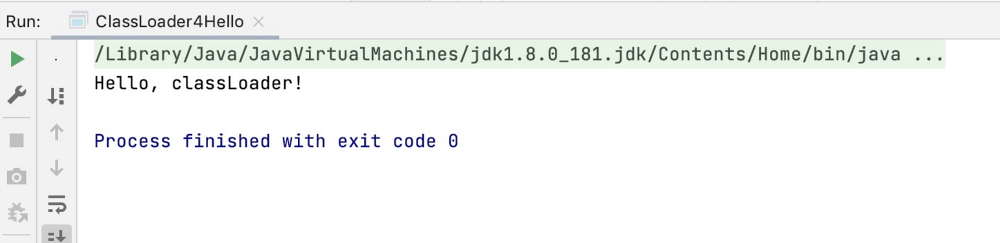
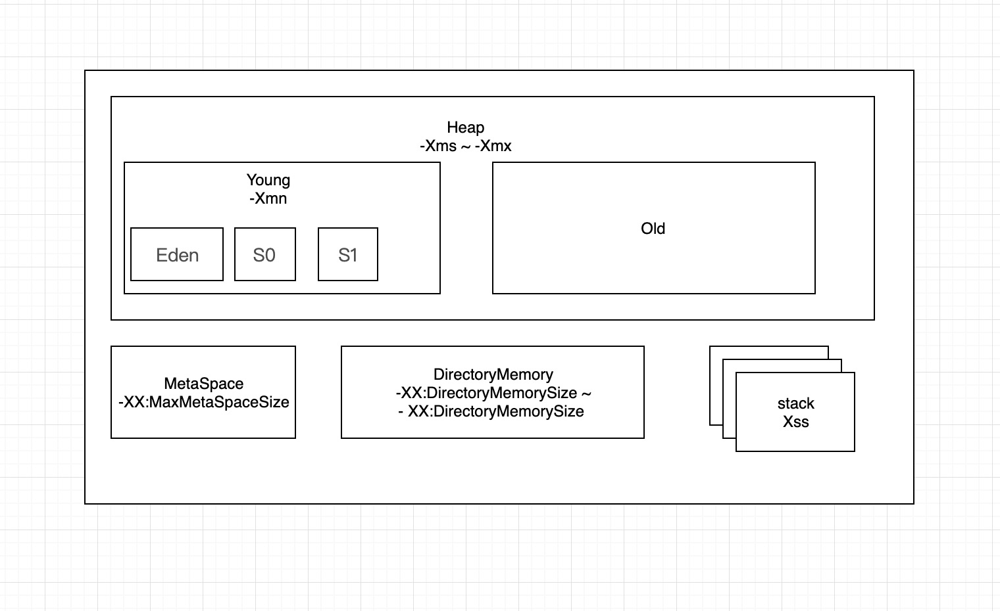

1.java，里面需要涉及基本类型，四则运行，if 和 for，然后自己分析一下对应的字节码，有问题群里讨论。
```
package pers.fffjia.javacamp.week1.demo1;

public class Hello4Cal {

    public static void main(String[] args) {
        int a = 2000;
        int b = 2;
        int c;
        c = (a + b - b) * b / b;
        for(int i=0;i<c;i++){
            if(i<b)
                a=i;
        }
    }
}
```

```
  Last modified 2021-3-17; size 431 bytes
  MD5 checksum 9118cafcae2f955e9ee448e3adc1dedf
  Compiled from "Hello4Cal.java"
public class pers.fffjia.javacamp.week1.demo1.Hello4Cal
  // 小版本
  minor version: 0
// 大版本 52 也就是jdk 1.8
  major version: 52
// 修饰符public 存在父类（超类）
  flags: ACC_PUBLIC, ACC_SUPER
// 常量池
Constant pool:
// 方法的引用 指向 常量3 和 常量12 
   #1 = Methodref          #3.#12         // java/lang/Object."<init>":()V
   #2 = Class              #13            // pers/fffjia/javacamp/week1/demo1/Hello4Cal
// 类型引用 指向 常量14
   #3 = Class              #14            // java/lang/Object
   #4 = Utf8               <init>
   #5 = Utf8               ()V
   #6 = Utf8               Code
   #7 = Utf8               LineNumberTable
   #8 = Utf8               main
   #9 = Utf8               ([Ljava/lang/String;)V
  #10 = Utf8               StackMapTable
  #11 = Class              #17            // "[Ljava/lang/String;"
  #12 = Utf8               SourceFile
  #13 = Utf8               Hello4Cal.java
  #14 = NameAndType        #4:#5          // "<init>":()V
  #15 = Utf8               pers/fffjia/javacamp/week1/demo1/Hello4Cal
  #16 = Utf8               java/lang/Object
  #17 = Utf8               [Ljava/lang/String;
{
  public pers.fffjia.javacamp.week1.demo1.Hello4Cal();
    descriptor: ()V
    flags: ACC_PUBLIC
    Code:
      stack=1, locals=1, args_size=1
         0: aload_0
         1: invokespecial #1                  // Method java/lang/Object."<init>":()V
         4: return
      LineNumberTable:
        line 3: 0

  public static void main(java.lang.String[]);
    descriptor: ([Ljava/lang/String;)V
    flags: ACC_PUBLIC, ACC_STATIC
    Code:
      stack=2, locals=5, args_size=1
         //当int取值-1~5采用iconst指令
//取值-128~127采用bipush指令
//取值-32768~32767采用sipush指令
//取值-2147483648~2147483647采用 ldc 指令
// 使用sipush 压入常量 2000 到操作数栈中
         0: sipush        2000
// 将栈顶的2000 存储到局部变量表的 第1个位置
         3: istore_1
// 使用 iconst 压入，常量2 到操作数栈中
         4: iconst_2
// 将栈顶的2 存储到局部变量表的 第2个位置
         5: istore_2
// 局部变量表的 第1个位置的2000 压入到栈中
         6: iload_1
// 局部变量表的 第2个位置的2 压入到栈中
         7: iload_2
// 将栈顶的 两个操作数 2000 2 相加（2002-2），并且结果（2002）再次压入栈中
         8: iadd
// 局部变量表的 第2个位置的2 压入到栈中
         9: iload_2
// 将栈顶的 两个操作数 2002 2 相减（2002-2），并且结果（2000）再次压入栈中
        10: isub
// 局部变量表的 第2个位置的2 压入到栈中
        11: iload_2
// 将栈顶的 两个操作数 2000 2 相乘（2000/2），并且结果（4000）再次压入栈中
        12: imul
// 局部变量表的 第2个位置的2 压入到栈中
        13: iload_2
// 将栈顶的 两个操作数 4000 2 相除（4000/2），并且结果（2000）再次压入栈中
        14: idiv
// 将栈顶的2000 存储到局部变量表的 第3个位置
        15: istore_3
// 使用 iconst 压入，常量0 到操作数栈中     
        16: iconst_0
// 将栈顶的0 存储到局部变量表的 第4个位置 i=0   
        17: istore        4
// 局部变量表的 第4个位置的i=0 压入到栈中
        19: iload         4
// 局部变量表的 第3个位置的2000 压入到栈中
        21: iload_3
// 比较栈顶的两个操作数 0<2000 如果是true 则继续；如果是false 则进入40位置的字节码指令 return
        22: if_icmpge     40
// 局部变量表的 第4个位置的i=0 压入到栈中        
        25: iload         4
// 局部变量表的 第2个位置的2 压入到栈中 
        27: iload_2
// 比较栈顶的两个操作数 0<2 如果是true 则继续；如果是false 则进入34位置的字节码指令 iinc          4, 1
        28: if_icmpge     34
// 局部变量表的 第4个位置的i=0 压入到栈中        
        31: iload         4
// 将栈顶的0 存储到局部变量表的 第1个位置的a
        33: istore_1
// 局部变量表的 第4个位置的i=0 进行自增1
        34: iinc          4, 1
// 字节码执行到第19行
        37: goto          19
        40: return
      LineNumberTable:
        line 6: 0
        line 7: 4
        line 9: 6
        line 10: 16
        line 11: 25
        line 12: 31
        line 10: 34
        line 14: 40
// 栈图 为了提高JVM在类型检查的验证过程的效率

      StackMapTable: number_of_entries = 3
        frame_type = 255 /* full_frame */
          offset_delta = 19
          locals = [ class "[Ljava/lang/String;", int, int, int, int ]
          stack = []
        frame_type = 14 /* same */
        frame_type = 250 /* chop */
          offset_delta = 5
}
SourceFile: "Hello4Cal.java"
```

2.（必做）自定义一个 Classloader，加载一个 Hello.xlass 文件，执行 hello 方法，此文件内容是一个 Hello.class 文件所有字节（x=255-x）处理后的文件。文件群里提供。
答：ClassLoader4Hello
```
package pers.fffjia.javacamp.week1.demo1;

import java.io.File;
import java.io.FileInputStream;
import java.io.IOException;
import java.lang.reflect.InvocationTargetException;
import java.lang.reflect.Method;

public class ClassLoader4Hello extends ClassLoader {

  public static void main(String[] args) {
    try {
      Object object = new ClassLoader4Hello().findClass("Hello").newInstance();
      Method method = object.getClass().getMethod("hello");
      method.invoke(object);

    } catch (InstantiationException e) {
      e.printStackTrace();
    } catch (IllegalAccessException e) {
      e.printStackTrace();
    } catch (ClassNotFoundException e) {
      e.printStackTrace();
    } catch (NoSuchMethodException e) {
      e.printStackTrace();
    } catch (InvocationTargetException e) {
      e.printStackTrace();
    }
  }

  @Override
  protected Class<?> findClass(String name) throws ClassNotFoundException {

    byte[] bytes = readFile("/Users/jiaruifeng/github/javacamp/src/pers/fffjia/javacamp/week1/demo2/Hello.xlass");
    return defineClass(name, bytes, 0, bytes.length);
  }

  private byte[] readFile(String filename) {

    File file = new File(filename);
    FileInputStream in = null;
    byte[] bytes = new byte[(int) file.length()];

    try {
      in = new FileInputStream(filename);
      int c;
      int i = 0;
      while (true) {
        if (!((c = in.read()) != -1)) {
          break;
        }
        bytes[i] = (byte) (255 - c);
        i++;
      }
    } catch (IOException e) {
      e.printStackTrace();
    } finally {
      if (in != null) {
        try {
          in.close();
        } catch (IOException e) {
          e.printStackTrace();
        }
      }
    }
    return bytes;
  }
}

```


输出结果：Hello, classLoader!




3.（必做）画一张图，展示 Xmx、Xms、Xmn、Meta、DirectMemory、Xss 这些内存参数的关系。



4.（选做）检查一下自己维护的业务系统的 JVM 参数配置，用 jstat 和 jstack、jmap 查看一下详情，并且自己独立分析一下大概情况，思考有没有不合理的地方，如何改进。
注意：如果没有线上系统，可以自己 run 一个 web/java 项目。

5.（选做）本机使用 G1 GC 启动一个程序，仿照课上案例分析一下 JVM 情况。
